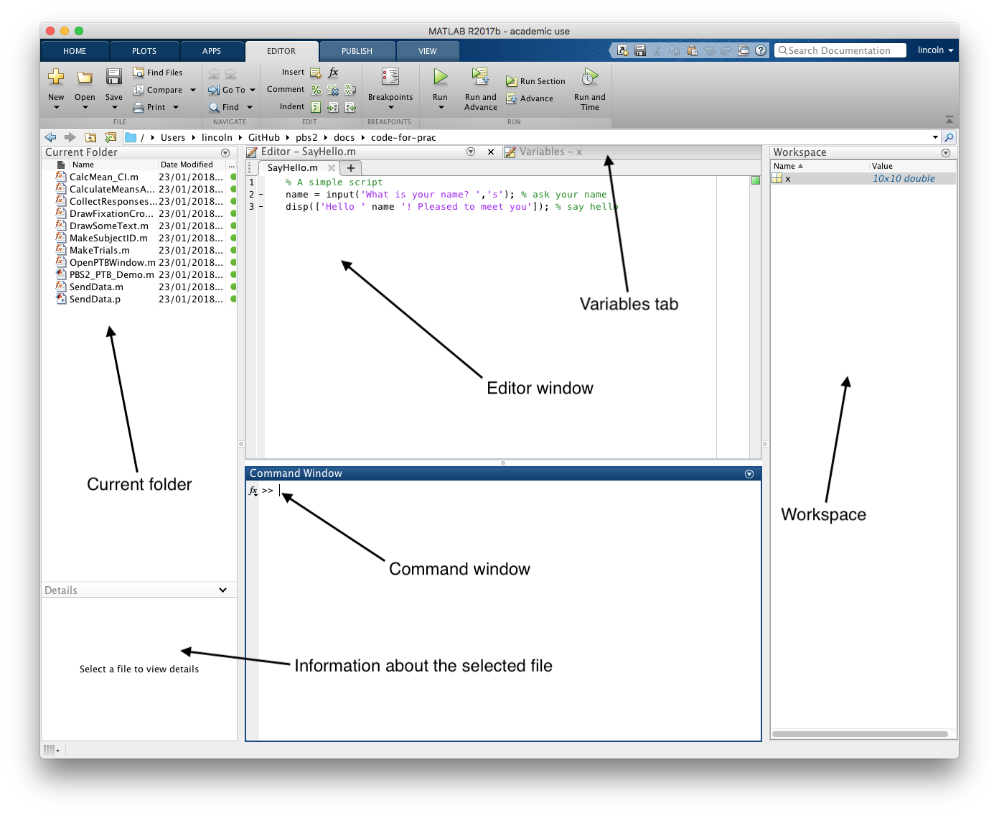
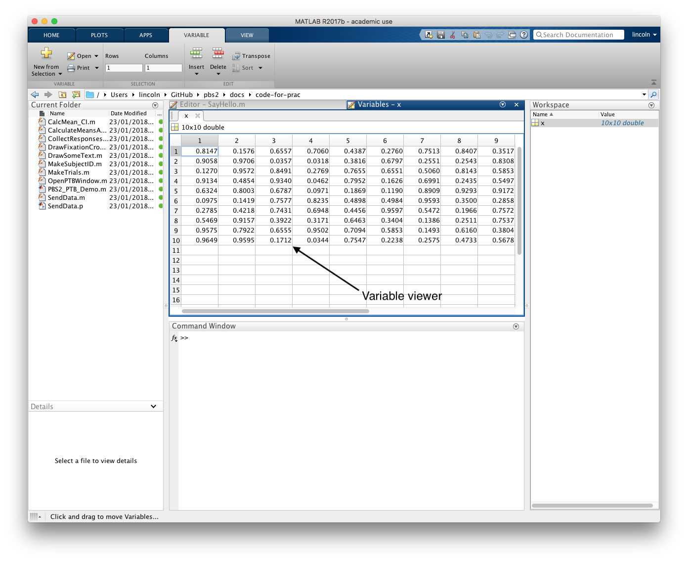

<!-- 
vim: set ft=markdown tw=80 spell spelllang=en_gb:
vim: set conceallevel=0 foldlevel=1:
-->

```{r, include=FALSE}
knitr::opts_chunk$set(warning = FALSE, message = FALSE)
```

```{r, echo=FALSE, eval=TRUE}
library(xaringanthemer)

style_duo_accent(
 primary_color = "#003b49",
secondary_color = "#1d4289",
header_font_google = google_font("Cabin"),
text_font_google   = google_font("Noto Sans", "300", "300i"),
code_font_google   = google_font("Fira Mono"),
colors = c(
red = "#d3273e",
purple = "#5d3754s",
orange = "#dc582a",
green = "#007a78",
white = "#FFFFFF",
blue = "#1d4289"
)
)
xaringanthemer::style_extra_css(
  list(".title-slide" = list(
   # "background-image" =
   #   "url(https://upload.wikimedia.org/wikipedia/commons/thumb/3/34/University_of_Sussex_Logo.svg/480px-University_of_Sussex_Logo.svg.png)",
  "background-position" =  "95% 95%",
 "background-size" = "180px",
  "border" = "10px solid #013035",
  "background-color" = "#FFFFFF"
  ),
 ".title-slide h1" = list(
  "padding-top" = "0px",
  "font-size" = "60px",
  "text-align" = "left",
  "padding-bottom" = "18px",
  "margin-bottom" = "18px",
  "margin-top" = "0px",
  "color" = "#003b49"
 ),
 ".title-slide h2" = list(
   "font-size" = "40px",
   "text-align" = "left",
   "padding-top" = "10px",
   "margin-top" = "0px",
   "color" = "#003b49"
 ),
 ".title-slide h3" = list(
   "font-size" = "30px",
   "color" = "#26272A",
   "text-align" = "left",
   "text-shadow" = "none",
   "padding" = "0px",
   "margin" = "0px",
   "line-height" = "1"),
 ".footnote" = list(
   "font-size" = ".6em"
 ),
   ".section h1" = list(
    "padding" = "auto",
    "display" = "block",
    "margin-left" = "auto",
    "margin-right" = "auto",
    "padding-top" = "250px",
    "vertical-align" = "auto",
    "align-items" = "center",
    "font-size" = "40px"
   ),
".section .remark-slide-number" = list(
   "display" = "none"),
   "pre" = list("border-style" = "solid",
   "border-width" = "1px",
   "border-color" = "lightgrey",
   "padding" = "5px",
   "border-radius" = "3px")
))

```


```{r broadcast, echo=FALSE}
xaringanExtra::use_broadcast()
xaringanExtra::use_share_again()
xaringanExtra::use_xaringan_extra(c("tile_view", "animate_css", "tachyons"))
```


# Introduction 

**[The course website](https://renybb.github.io/arm-matlab-2024/)** will contain a lot of information that
will be useful for this course, including:

1. The lecture slides

2. Downloadable code snippets

3. Cheat sheets and tips

4. Starter code for the assessment

**Make sure that you visit it!**

---

## The aim of this mini-module

- Get you familiar with the basics of programming

- Get you familiar with how to find help when you encounter a new programming
  challenge

- Learn the basics of working with data in `Matlab`

- Introduce you to the basics of `PsychToolbox`, a set of `Matlab` tools for
  stimulus presentation and response collection


The aim of this module is not to give you a set of instructions on how to do a
bunch of specific things in `Matlab`. Rather, the aim is to give you a set of 
tools that will allow you to *figure out* how to do the things you want to do 
with `Matlab`

---

## Why Matlab and not…


- `Matlab` provides a one-stop-shop with all the common tools you‘ll need for
  research in cognitive neuroscience 

- `Matlab` is great for working with arrays and matrices (that is, the kind of
  data structures we commonly encounter in cognitive neuroscience).

- Many popular toolboxes (SPM, EEGLab) for working with cog-neuro data (e.g.,
  *fMRI*, *EEG*, *MEG*, *PET*) have been built in `Matlab` and are only
  available in `Matlab` 

- Although this course is focused on `Matlab` you'll hopefully learn enough of
  the fundamentals of programming so that learning a new language will be
  easier…


---

## My approach to programming

Often people don't care *how* they solve a problem, only that their code
*works*…

But it's better to do it right the first time and write code with 3 assumptions
in mind

1. That you'll understand **nothing** next time you look at **your** code

2. That *somebody else* will be using your code

3. That your code will need to run on another computer at some point

I'll try to teach you some good practices that will help you with all these.

And although we'll be learning this in the context of `Matlab` the *principles*
will also apply to other languages like `R` or `Python` (although the exact
**procedures** will differ)

---

### The process of writing programs

Writing a program involves:

- Breaking down problems into solvable steps

- Often lots or trial-and-error to check how bits of code work

- Debugging and finding errors, which can often take longer than the initial
  programming

But the more you practice, the better you'll get.

The **problem-solving** part of programming is the hardest. Once you have
the **steps**, writing the code can be pretty straightforward.

Because of this, we'll also work on some general problem-solving tasks…

95% of questions I typically get on this course are not _programming
questions_, they're questions about the _logic_ of the problem.

You should be able to _explain the steps that you need to take to solve the
problem_ in **plain English** before you start trying to write code…

---

## Knowing how/where to get help

Don't worry if you can't remember all the syntax and commands.

You don't need to remember something if you know how to look it up!

- If you're having trouble solving a problem chances are somebody has
  encountered a similar problem, so know how to look for other people's
  solutions. [Google](http://google.com), [Stack
  Overflow](https://stackoverflow.com/questions/tagged/matlab), and the [Matlab
  Central](http://mathworks.com/matlabcentral/) websites are your friend! 

But remember, when asking a question there **is** a difference between a
**good** question and a **bad** question. A **good question** will provide
enough information so that the person helping you will be able to give you a
helpful answer.

For tips see:

- [Writing a good
  question](https://codeblog.jonskeet.uk/2010/08/29/writing-the-perfect-question/)

- [How do I ask a good question?](https://stackoverflow.com/help/how-to-ask)

---

class: section

# Getting started 

---

# <small>Getting started</small>

By now you should've installed `Matlab` on your computer.

If you haven't, then you'll have a chance to install it in the break.

You can install it by following the instructions on the [University IT
website](http://www.sussex.ac.uk/its/services/software/owncomputer/matlab)

<iframe width=730 height=350 src="http://www.sussex.ac.uk/its/services/software/owncomputer/matlab" style="border:none"></iframe>

---
class: section

# The basics of `Matlab`

In this section, we'll cover the basics of the `Matlab` IDE (*integrated
development environment*)

---

## <small>The `Matlab` GUI</small>

.center[]

.footnote[If you've used the `R` IDE **RStudio** you'll notice that `Matlab` and
**RStudio** don't look radically difference]

---

## <small>The `Matlab` GUI</small>

.center[]

---

### Parts of the `Matlab` GUI

- The **Current Folder** pane allows you to browse the files in our working
  directory

- When you click on a filename then you'll be able to view information
  about that file (for example, any *comments* at the start of the file or
  *data* contained in the file)

- The **Workspace** gives us a list of the data (**variables**) that are
  currently loaded in `Matlab`.

- We can also browse the details of these variables in the **Variables** viewer
  tab.

- The **Editor** pane allows us to edit files (**script** and **function**
  files).

- Finally, the **Command window** is where we can type the commands we want to
  run…

---

## <small>The anatomy of a program…</small>

A computer program is just a set of instructions that tells the computer what
to do…

This might include, instructions to…

1. Read data from a file.

2. Get input from the user.

3. Display something on the screen.

4. Process data in a particular way.

5. Write data to a file


Instructions that tell `Matlab` to perform these kinds of actions are
called **functions…**

In this course, we're going to **use** functions, but we're also going to 
**write** functions.

---

### Using a function…

- Regular functions in `Matlab` have a name. We use the name of the function to
  use, or _call_ that function.

- Most functions will also take one or more inputs, and produce one or more
  outputs

An example of a function in `Matlab` is the `cos` function. The `cos` function
works out the **cosine** of a number. It needs an input (a number) and produces
an output (the cosine of that number)


We can run this function at the command prompt `>>` by using its name (`cos`)

```matlab
>> cos(0)

ans =

     1
```
---

### Using a function…
Notice that the **input** to a function goes inside `()`. If the function took
several inputs then they would be separated by `,`.

zeros(m,n)
```matlab
>> zeros(2,3)

ans =

     0     0     0
     0     0     0
```

---

### Inputs and outputs to functions

In the previous examples, we directly wrote in the numbers that we wanted to
use as the input to our function… 

… and the output of the function was printed out directly to the
command window

- But it's far more often the case that we'll have some data stored in a
  variable, and that we'll want to use this data as the input to our function

- And it's more often the case that we'll want to store the output of a
  function in a variable so we can use it for some other purpose
  (e.g., as an input to another function or to write it to a file).

---

### Inputs and outputs to functions

Variables in `Matlab` always have a name.

Variable names must be one word (no spaces) and must start with a letter

We use the `=` sign to **assign** some data to a variable…

```matlab
>> my_number = 0

my_number =

     0
```


It's a good idea to give variables *meaningful* and *descriptive* names so
that you know what they contain…

---

### Inputs and outputs to functions

We can use the **variable** as the input to a function by using the
variable name

```matlab
>> cos(my_number)

ans =

     1
```

We can also assign the output from a function to a variable

```matlab
>> cosine_of_number = cos(my_number)

cosine_of_number =

     1
```

If you've used `R` before, then all of this should be very familiar.

---

### Suppressing output


When you run commands in `Matlab`, the commands will often produce **outputs**
that are printed to the screen… even if you assign the output to a
variable<sup>1</sup>

To suppress the output we add a `;` to the end of the line.

**Showing the output…**    
```matlab
>> cosine_of_number = cos(my_number)

cosine_of_number =

     1
```
**Suppressing the output…**   
```matlab
>> cosine_of_number = cos(my_number);
```

.footnote[<sup>1</sup>If you've used `R` before you'll know that outputs can
be assigned to a variable **or** printed to the screen. This is not the case with
`Matlab` where outputs can be assigned to variables **and** printed to the
screen.]
  
---

### Comments

- Comments are important because they help other people (and future you)
  understand your code. They're little notes in your code.

- In `Matlab`, comments are marked with `%`. Anything that comes after the
  `%` isn't run by `Matlab`.

```matlab
>> A = 1; % This is a comment and isn't run by Matlab 

>> % This is also a comment, but it's on a line of it's own
```

It's also possible to make comment **blocks** and to use comments to create
**code cells**, but we'll explore those when we're up and running with `Matlab`.

The common place where you'll write comments is at the start of functions that
you write to provide help to the user on how to use your functions. We'll cover
how to do this later in the course.
