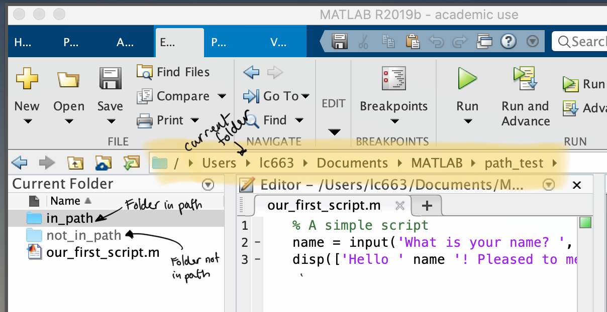

<!-- 
vim: set ft=markdown tw=80 spell spelllang=en_gb:
vim: set conceallevel=0 foldlevel=1:
-->


```{r, include=FALSE}
knitr::opts_chunk$set(warning = FALSE, message = FALSE)
```

```{r, echo=FALSE, eval=TRUE}
library(xaringanthemer)

style_duo_accent(
 primary_color = "#003b49",
secondary_color = "#1d4289",
header_font_google = google_font("Cabin"),
text_font_google   = google_font("Noto Sans", "300", "300i"),
code_font_google   = google_font("Fira Mono"),
colors = c(
red = "#d3273e",
purple = "#5d3754s",
orange = "#dc582a",
green = "#007a78",
white = "#FFFFFF",
blue = "#1d4289"
)
)
xaringanthemer::style_extra_css(
  list(".title-slide" = list(
   # "background-image" =
   #   "url(https://upload.wikimedia.org/wikipedia/commons/thumb/3/34/University_of_Sussex_Logo.svg/480px-University_of_Sussex_Logo.svg.png)",
  "background-position" =  "95% 95%",
 "background-size" = "180px",
  "border" = "10px solid #013035",
  "background-color" = "#FFFFFF"
  ),
 ".title-slide h1" = list(
  "padding-top" = "0px",
  "font-size" = "60px",
  "text-align" = "left",
  "padding-bottom" = "18px",
  "margin-bottom" = "18px",
  "margin-top" = "0px",
  "color" = "#003b49"
 ),
 ".title-slide h2" = list(
   "font-size" = "40px",
   "text-align" = "left",
   "padding-top" = "10px",
   "margin-top" = "0px",
   "color" = "#003b49"
 ),
 ".title-slide h3" = list(
   "font-size" = "30px",
   "color" = "#26272A",
   "text-align" = "left",
   "text-shadow" = "none",
   "padding" = "0px",
   "margin" = "0px",
   "line-height" = "1"),
 ".footnote" = list(
   "font-size" = ".6em"
 ),
   ".section h1" = list(
    "padding" = "auto",
    "display" = "block",
    "margin-left" = "auto",
    "margin-right" = "auto",
    "padding-top" = "250px",
    "vertical-align" = "auto",
    "align-items" = "center",
    "font-size" = "40px"
   ),
".section .remark-slide-number" = list(
   "display" = "none"),
   "pre" = list("border-style" = "solid",
   "border-width" = "1px",
   "border-color" = "lightgrey",
   "padding" = "5px",
   "border-radius" = "3px")
))

```


```{r broadcast, echo=FALSE}
xaringanExtra::use_broadcast()
xaringanExtra::use_share_again()
xaringanExtra::use_xaringan_extra(c("tile_view", "animate_css", "tachyons"))
```


```{r, echo=FALSE, eval=FALSE}
# I'll add some meta data later
# library(metathis)
# meta() %>%
#   meta_description(desc)
```

# Scripts

Typing commands in the **Command Window** isn't very efficient because it doesn't allow us to save and re-use code. 

And often we'll want to save and re-use code for later use.

We can use **scripts** (files with an `.m` extension) to store a series of
commands that we can then re-run.

---

## <small>The search path</small>

The **search path** is a list of all the folders on your computer where `Matlab`
will look for `.m` files.

By default, the search path will include several folders related to `Matlab`
and a folder in your `Document` folder, usually something like:
  - `/Users/USERNAME/Documents/Matlab` or 
  - `C:/Users/USERNAME/Documents/Matlab`

You can *view* your search path with the `path` command:

```matlab
>> path

		MATLABPATH

	/Users/lc663/Documents/MATLAB
	/Users/lc663/matlab
	/Applications/MATLAB_R2019b.app/toolbox/matlab/timefun
```

---

## <small>The search path</small>

.center[]

An annotated `Matlab` window showing an example of a folder in the
search path, a folder not in the search path, and the current folder.

---

## Creating a script

The easiest way to create a new script (or function) file is with the `edit`
command.

Type `edit` followed by the name of the new file you want to create.

```matlab
>> edit say_hello.m
```

Valid names for script files:

1. Must be **one** word without spaces.

2. Has the extension `.m`

3. Doesn't start on a number

Helpfully, `Matlab` will show an error and give you a chance to edit the name if
you don't follow the rules!


---

## Creating a script

We can create a script called `say_hello.m`<sup>1</sup>

You can copy the code below into the editor window and save it!

```matlab
% A simple script
name = input('What is your name? ','s'); % ask your name
disp(['Hello ' name '! Pleased to meet you']); % say hello
```

Once we've saved the script, we can run it by typing its name at the command
prompt.

```matlab
>> say_hello
```

Or by using the `run` command with the filename (this is useful if the file is
**not** in our search path)

```matlab
>> run say_hello.m
```


.footnote[<sup>1</sup>You can also cut and paste the code for this script from
the [Part 1](/part1.html) page]

---

### Script sections

Our simple script has one section, but it can be useful to break scripts
down into sections.

Sections can be run *independently*, which can be useful when we're debugging
code.

To create a script section, do two comment symbols `%` on a line by
themselves.

```matlab
disp('I am section 1')

%%

disp('I am section 2')

```

You can run sections by clicking on the **Run Section** button on the toolbar,
or by hitting CTRL+ENTER / CMD+ENTER when your cursor is in a section.

---

## Adding help to a script

Back in Part I, we saw that we could get **help** on `Matlab` commands by using
the `help` command.

For example, to get help on the `randn` function: 

```matlab
>> help randn
```

The same works for scripts/functions you write yourself:

```matlab
>> help say_hello
  A simple script
```

Any comments at the start of the file are printed out when you ask for `help`.

A good habit is to write your own documentation (what gets printed out by
`help`) for any of the scripts and functions you write.
