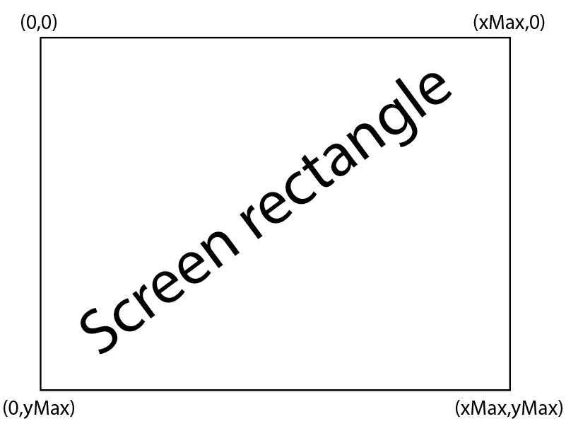
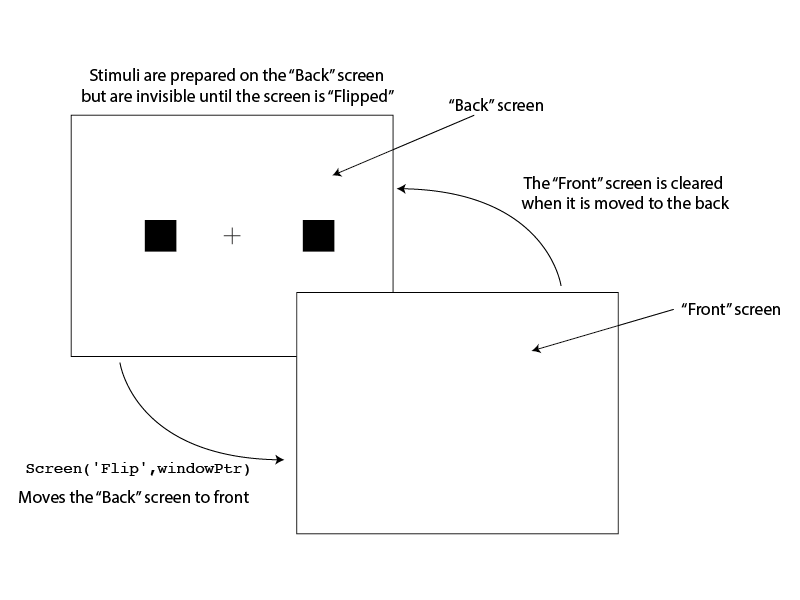
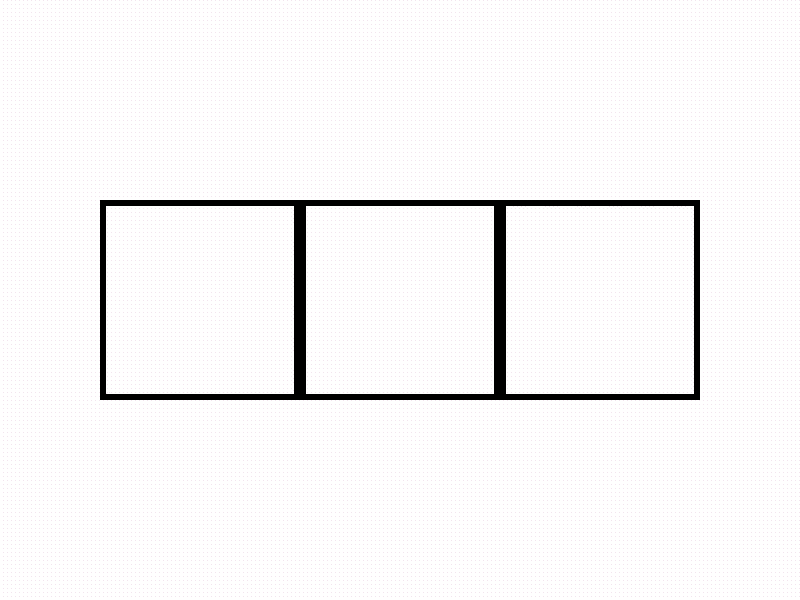
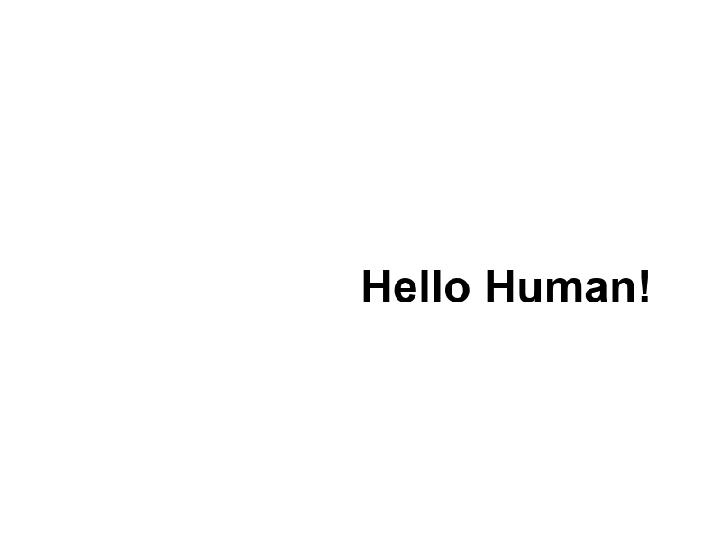
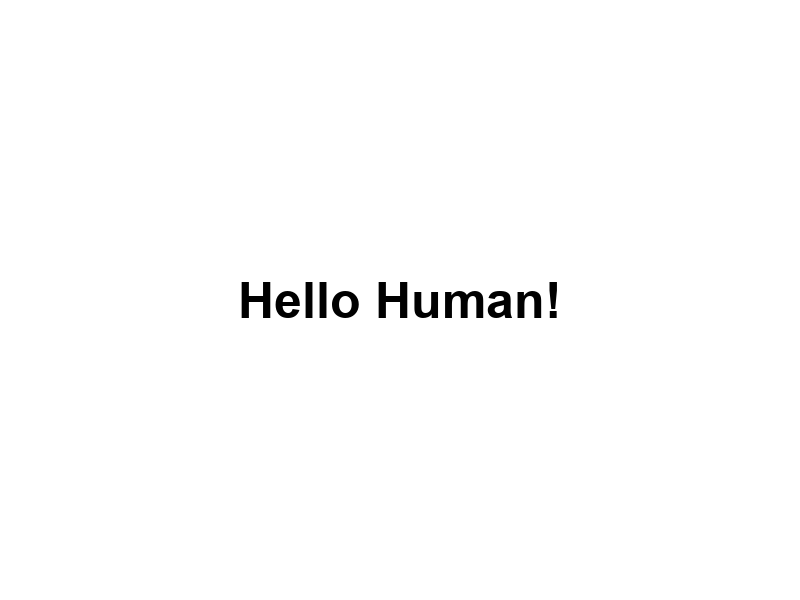
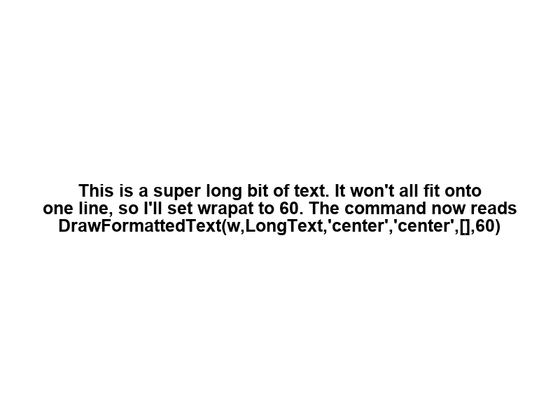

<!-- 
vim: set ft=markdown tw=80 spell spelllang=en_gb:
vim: set conceallevel=0 foldlevel=1:
-->

```{r, include=FALSE}
knitr::opts_chunk$set(warning = FALSE, message = FALSE)
```

```{r, echo=FALSE, eval=TRUE}
library(xaringanthemer)

style_duo_accent(
 primary_color = "#003b49",
secondary_color = "#1d4289",
header_font_google = google_font("Cabin"),
text_font_google   = google_font("Noto Sans", "300", "300i"),
code_font_google   = google_font("Fira Mono"),
colors = c(
red = "#d3273e",
purple = "#5d3754s",
orange = "#dc582a",
green = "#007a78",
white = "#FFFFFF",
blue = "#1d4289"
)
)
xaringanthemer::style_extra_css(
  list(".title-slide" = list(
   # "background-image" =
   #   "url(https://upload.wikimedia.org/wikipedia/commons/thumb/3/34/University_of_Sussex_Logo.svg/480px-University_of_Sussex_Logo.svg.png)",
  "background-position" =  "95% 95%",
 "background-size" = "180px",
  "border" = "10px solid #013035",
  "background-color" = "#FFFFFF"
  ),
 ".title-slide h1" = list(
  "padding-top" = "0px",
  "font-size" = "60px",
  "text-align" = "left",
  "padding-bottom" = "18px",
  "margin-bottom" = "18px",
  "margin-top" = "0px",
  "color" = "#003b49"
 ),
 ".title-slide h2" = list(
   "font-size" = "40px",
   "text-align" = "left",
   "padding-top" = "10px",
   "margin-top" = "0px",
   "color" = "#003b49"
 ),
 ".title-slide h3" = list(
   "font-size" = "30px",
   "color" = "#26272A",
   "text-align" = "left",
   "text-shadow" = "none",
   "padding" = "0px",
   "margin" = "0px",
   "line-height" = "1"),
   ".midpage h3" = list(
   "font-size" = ".6em",
   "margin-bottom" = ".2em"),
 ".footnote" = list(
   "font-size" = ".6em"
 ),
   ".section h1" = list(
    "padding" = "auto",
    "display" = "block",
    "margin-left" = "auto",
    "margin-right" = "auto",
    "padding-top" = "250px",
    "vertical-align" = "auto",
    "align-items" = "center",
    "font-size" = "40px"
   ),
".section .remark-slide-number" = list(
   "display" = "none"),
   "pre" = list("border-style" = "solid",
   "border-width" = "1px",
   "border-color" = "lightgrey",
   "padding" = "5px",
   "border-radius" = "3px")
))

```


```{r broadcast, echo=FALSE}
xaringanExtra::use_broadcast()
xaringanExtra::use_share_again()
xaringanExtra::use_xaringan_extra(c("tile_view", "animate_css", "tachyons"))
```


# `PsychToolbox`

What is `PsychToolbox`?

- A set of `Matlab` functions originally used for visual psychophysics research

- Brainard, D. H. (1997) The Psychophysics Toolbox, *Spatial Vision*, 10, 433–436.

## <small>Installing PTB</small>

The easiest way to install PTB is to download the `DownloadPsychtoolbox.m` file
from the [PsychToolbox website](http://psychtoolbox.org/download)

You can then run…

```matlab
>> DownloadPsychtoolbox
```

…to install it.

---
class: section

# The `Screen` 

---

# The `Screen`

When you present visual stimuli with `PTB` you present it on the "`Screen`", so
understanding how the `Screen` function works is vitally important.

- The screen coordinate system

- The double buffer system

- Opening a new window

- Determining the screen size

---

## The `Screen` coordinate system

.center[</img>]
<caption>How coordinates are specified on the screen</caption>

---

## <small>The `PsychToolBox` Screen buffer system</small>

.center[</img>]
<caption>How the double screen buffer in PTB works</caption>

---

## The `OpenWindow` command

```matlab
[windowPtr,rect]=Screen('OpenWindow',windowPtrOrScreenNumber ...
  [,color] [,rect]);
```

##### The inputs:

- `windowPtrOrScreenNumber` specifies which monitor to open the screen on, e.g.,
  `0` is the main monitor (this is only important for multi-monitor setups).

- `color` sets the window's background colour. The default is white, but often
  you’ll want black or a mid-grey colour.

- `rect` sets the window size. The default is the full screen.

##### The outputs:

- `windowPtr` tells you what screen you opened. You can use this with later
  commands to make sure you draw stimuli to the same screen you opened.

- `rect` tells you the size of the screen you opened. You can use this with
  later commands to make sure you place stimuli with the correct coordinates.

---

## The `OpenWindow` command

If you need to get help about the `OpenWindow` command, you can type `Screen
OpenWindow?` at the `matlab` command line:

```matlab
>> Screen OpenWindow?
```

**Note:** If you’re using multiple monitors, and you want to get the screen
numbers for the different monitors, then you can use `Screen('Screens')` and
`PTB` will output the screen indexes. 


---

## Determining the screen size

`PTB` has several helper commands that can help you determine the size of the
screen.

```matlab
[width, height]=Screen('WindowSize', windowPointerOrScreenNumber)
```

- The `width` and `height` of the screen in pixels


```matlab
[x,y] = RectCenter(rect)
```

- The `x` and `y` coordinates of the centre of the screen.

Knowing the **centre** of the screen is useful for positioning fixation points,
and knowing the **width** and **height** will help you with deciding where to
place stimuli.

---
class: section

# Adding stimuli to the `Screen`

---

## Drawing shapes

`PTB` provides ways to draw stimuli, including drawing lines, boxes, and
circles:

  - `Screen('FillRect',windowPtr,color,rect)`

  - `Screen('FrameRect',windowPtr,color,rect,'penWidth')`

  - `Screen('FillOval',windowPtr,color,rect)`

```matlab
% open a 800 x 600 px PTB window and
% draw a 100 x 100 px black rectangle in the middle of the screen

% open a new window
[windowPtr,rect]=Screen('OpenWindow',0, [],[0 0 800 600])

% find the center for the screen
[x,y] = RectCenter(rect)

% draw a draw the rectangle
Screen('FillRect',windowPtr, [0 0 0], [x-50 y-50 x+50 y+50])

% flip the screen
Screen('Flip',windowPtr)
```

---


## Drawing lines

To drawing shapes, `PTB` can also draw lines:

```matlab
Screen('DrawLine', windowPtr [,color], fH, fV, tH, tV [,pWidth]
```
	
Draws a line from `(fH,fV)` to `(tH,tV)` that is `pWidth` thick.

---

## Shape demo

.center[</img>]

.footnote[Note: In `PTB`, you can layer shapes on top of each other. You can use
this to build up complex images piece by piece. There are other drawing
commands such as `DrawDots`, and `DrawLines`. You can explore them all by
reading through the `PTB` manual or by exploring Peter Scarfe’s [PTB demo
site](http://peterscarfe.com/ptbtutorials.html)]

---

## Drawing text

Writing text to the screen with `PTB` requires a couple of steps:

1. Set the text attributes

	- `TextSize`: How big is it?
    
	- `TextFont`: What font is it?
    
	- `TextStyle`: Is it **bold**, *italics* etc?

2. Draw the text with `Screen('DrawText',...)` or `DrawFormattedText()`

  - `DrawFormattedText()` allows for line breaking (and other formatting) so
    it’s good for presenting instructions. If we’re just presenting text
    stimuli, then `Screen('DrawText',...)` will do.

---

### <small>Screen('DrawText',...)</small>

The `DrawText` command takes a number of options

```matlab
[newX,newY,textHeight]=Screen('DrawText', windowPtr, text [,x] [,y] ...
 [,color] [,backgroundColor] [,yPositionIsBaseline]...
 [,swapTextDirection]);
```

- `text` is the text you want to display

- `x` & `y` are the coordinates for where the pen starts drawing

- The remaining options allow you to set the colour, the background colour,
  whether to start the 'pen' at the top or bottom of the text, and the writing
  direction.

---

### <small>DrawFormattedText()</small>

The `DrawFormattedText()` function also takes a number of options:

```matlab
[nx, ny, textbounds, wordbounds] = DrawFormattedText(windowPtr,...
 text [, sx][, sy] [, color][, wrapat] [, flipHorizontal] ...
 [, flipVertical][, vSpacing] [, righttoleft][, winRect])
```

- Unlike `ScreenScreen('DrawText',...)`, `DrawFormattedText()` allows you to
  specify the start of an invisible bounding box around the text (rather than
  the pen start position) with `sx` and `sy`

- You can also centre the text on the screen by setting `sx = 'center'` and `sy
  = 'center'`

- `wrapat` specifics how many characters per line you wrap the text at. This 
  is useful if you're presenting long strings of text.

---

### A <small>DrawText example</small>

```matlab
[w,rect] = Screen('OpenWindow',0); % open a window

[xCenter,yCenter] = RectCenter(rect); % get the centre coordinates

Screen('TextSize',w,50) % Set text size to 50

Screen('TextStyle',w,1) % Set the text to BOLD

Screen('DrawText',w,'Hello Human!',xCenter,yCenter) % draw the text
```

---

.center[</img>]

---

### <small>A DrawFormattedText() example</small>

```matlab
[w,rect] = Screen('OpenWindow',0); % open a window

[xCenter,yCenter] = RectCenter(rect); % get the centre coordinates

Screen('TextSize',w,50) % Set text size to 50

Screen('TextStyle',w,1) % Set the text to BOLD

DrawFormattedText(w,'Hello Human!','center','center')
```

---

.center[</img>]

---

### <small>wrapat at work</small>

.center[</img>]

---

class: section

# Collecting responses

---

# Collecting responses 

`PTB` can interact with many types of devices to collect responses,
including the keyboard, the mouse, and specialised button boxes.

And `PTB` can collect responses in a few different ways, depending on your
needs (Ease of use vs timing accuracy)


**Listing available devices**

- The `PsychHID()` function provides a method for interacting with Human
  Interface Devices such as keyboards, mice, etc.

- Before you can collect responses from, e.g., a keyboard, you’ll need to know
  its device number.  There are a couple of ways to do this…

---

**Listing available devices**

You can use `PsychHID` and `GetKeyboardIndices` to find out what devices you
have available.


```matlab
% returns a structure of all the available HIDs
devices = PsychHID('Devices') 

% returns the indices and names of all the keyboards
[deviceIndices, deviceNames] = GetKeyboardIndices  
```

- If you plug in and out keyboards and mice, then the device indices can change,
  so make sure you double-check before starting an experiment!

---

## Collecting keyboard responses

`PTB` provides functions for collecting keyboard responses. These
include:

- `GetChar()`: Get presses that are in the buffer (seldom used, so we
  won’t discuss it).

- `KbWait()`: Pauses until a key is pressed (good for instruction screens).

- `KbCheck()`: Check to see whether a key has been pressed.

- `KbQueueCheck()`: An alternative to `KbCheck()`, which provides very accurate timing


In the practical section, we'll mainly be using `KbWait()` and `KbQueueCheck()`,
so we’ll cover these in more detail. 

---

### The KbWait() function

```matlab
[secs, keyCode, deltaSecs] = KbWait([deviceNumber]...
 [, forWhat=0][, untilTime=inf])
```


- `deviceNumber` is the device that we want to use.

- `forWhat`: `0` when the key is pressed, `1` when the key is released, `2`
  when all the keys are released and then when a key is pressed, and `3`
  until all the keys are released and when a key is pressed and released.

- `untilTime`: how long to wait before moving on: e.g., `GetSecs() + 5` will
  wait 5 seconds and then move on

- `keyCode` tells you the code of the pressed key. `KbName(keyCode)` will tell
  you the name (e.g., `'space'`)

---

#### KbWait() example

```matlab
[w,rect] = Screen('OpenWindow',0); % open a window

[xCenter,yCenter] = RectCenter(rect); % get the centre coordinates

Screen('TextSize',w,12) % Set text size to 12

Screen('TextStyle',w,1) % Set the text to BOLD

DrawFormattedText(w,'Press any key to continue','center','center')

Screen('Flip',w)

KbWait(-1) % listenin to all devices
```

**Note:** An alternative to using `KbWait()` is to use `KbTriggerWait()`. 

This allows you to specify which key to wait for, but you have to specify the
`device` and can’t just use `-1` to listen to all devices. 

```matlab
% waits until space has been pressed on device 4.
KbTriggerWait(KbName('space'), 4)
```

---

### The KbQueueCheck function

The `KbQueueCheck()` function is used with a number of other functions to create
and check streams of keyboard responses.

1. `KbQueueCreate()`: Create a keyboard queue

2. `KbQueueStart()`: Start recording key press

3. `KbQueueStop()`: Stop recording key presses

4. `KbQueueCheck()`: Check for key presses

5. `KbQueueWait()`: Wait for key presses

6. `KbQueueFlush()`: Flush the keyboard queue

7. `KbQueueRelease()`: Destroy the keyboard queue


---

#### Using KbQueue 

```matlab
% create a queue on DEVICE where keyList defines which 
% keys to listen out for
KbQueueCreate(DEVICE,keyList); 

KbQueueStart(DEVICE); % start recording key presses

% get information about key presses
% if you want to end the trial when a key is pressed you'd put
% this command in a while loop and loop, for example, while pressed == 0
[pressed, firstPress, firstRelease, lastPress, lastRelease] = ...
    KbQueueCheck(DEVICE); 

KbQueueFlush(DEVICE); % to empty the stream between trials

KbQueueStop(DEVICE); % to stop recording keypresses 
KbQueueRelease(DEVICE); % to destroy the stream when you're done
```

---

#### Reading events from KbQueueCheck()

```matlab
[pressed, firstPress] = KbQueueCheck(DEVICE); 
```

`pressed`: outputs `1` if a key has been pressed, otherwise `0`

`firstPress`: is a 1 × 256 array that contains the time the key was pressed (each
element corresponds to a particular key)

- `find(firstPress > 0)` will find the `keycode` of the pressed key

- `KbName(find(firstPress > 0))` will tell you the name of the pressed key,
  e.g., `'space'`

- `firstPress(firstPress > 0)` will tell you the time the key was pressed

If you're checking for keyboard events inside a `while` loop, then you could
break the loop when any key is pressed or when a specific key is pressed.

This is useful if you only want to record _valid_ responses.


---

 
#### Measuring reaction times

A common reason for using software like `PTB` is to measure reaction time, i.e.,
the type between when a stimulus is shown and when a response is made.

```matlab
% draw a stimulus
Screen('FillRect',windowPtr, [0 0 0], [x-50 y-50 x+50 y+50])

% present the stimulus and record the time is was shown
stimOnset = Screen('Flip',windowPtr)

% collect some responses 
pressed = 0
while pressed = 0 % loop until a key press is detected
	[pressed, firstPress] = KbQueueCheck(DEVICE); 
end

% Calculate how quickly it took for the participant to press space
responseOnset = firstPress(KbName('space')) % get the press type for 'space'

reactionTime = responseOnset - stimOnset % different between stimOnset and responseOnset
```


